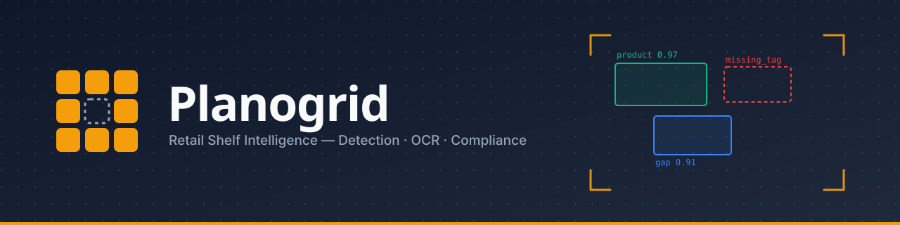
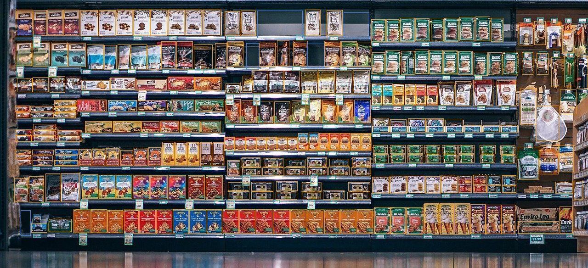
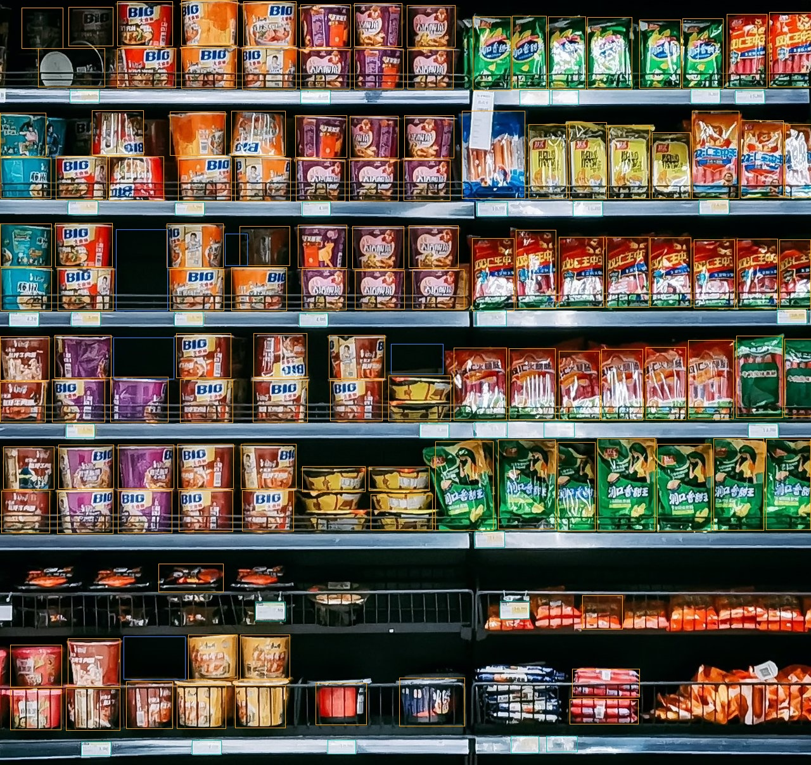

<div align="center">



[](LICENSE)
[](pyproject.toml)
[](DESIGN.md)

</div>

---

## Project Title

**Planogrid — Retail Shelf Intelligence via Multi-Detector Computer Vision**

## Problem Statement

Retail shelf compliance (are products stocked, are shelves empty, are price tags in place) is
currently audited manually by store staff walking the aisles — slow, inconsistent, and not
scalable across a large store footprint. A photograph of a shelf contains all the information
needed to answer these questions automatically, but a single photo can contain 100+ products of
varying scale, occlusion, and lighting, alongside much rarer empty-shelf gaps and small price
tags. This project builds a computer vision system that takes a shelf photograph and identifies
what's present, what's missing, and where the price tags are — turning a manual walk-the-aisle
task into an automatic one.

## Objectives

1. Detect every product facing in a shelf photograph.
2. Detect empty shelf space (gaps) as an out-of-stock signal.
3. Detect price-tag locations, as a precursor to OCR-based compliance checks.
4. Avoid the label-conflict trap of training one model on partially-annotated data (see
   [Methodology](#methodology)) by training three independent specialist detectors instead.
5. Serve the result through a real, working API and dashboard — not just an offline script —
   so the system can be demonstrated end to end.

## Dataset Used

Three detectors, each trained only on data where its one class is exhaustively labeled (see
[Methodology](#methodology) for why). Full source list with exact license per entry:
[`datasets/manifest.yaml`](datasets/manifest.yaml).

| Detector | Source(s) | Images | License |
|---|---|---|---|
| **Product** | [SKU-110K](https://github.com/eg4000/SKU110K_CVPR19) (fetched via Ultralytics' native downloader) | 11,762 images, ~1.73M boxes | Research use only |
| **Gap** | 3 Roboflow projects — [`fyp-ormnr/supermarket-empty-shelf-detector`](https://universe.roboflow.com), [`fyp-nrna1/empty-shelf-detector-pbyj7`](https://universe.roboflow.com), [`dsjourney/empty-spaces-detection-in-shelf-data`](https://universe.roboflow.com) | 3,505 images | Per Roboflow project |
| **Tag** | Kaggle [Humans in the Loop — Supermarket Shelves](https://www.kaggle.com/datasets/humansintheloop/supermarket-shelves-dataset) + 3 Roboflow price-tag projects | 1,685 images | CC0 1.0 / CC BY 4.0 |

Datasets are **not** redistributed in this repository — they're pulled on demand by
[`scripts/download_datasets.py`](scripts/download_datasets.py), pinned to an exact version in
`datasets/manifest.yaml` so a re-run always fetches the same data. A small zero-credential sample
set (45 real, CC0-licensed shelf photos) is committed directly at
[`assets/samples/`](assets/samples/) so the app and tests run with no API keys at all.

## Technologies / Libraries Used

- **Detection:** [Ultralytics YOLO26](https://github.com/ultralytics/ultralytics), PyTorch (CUDA)
- **Backend:** FastAPI, Pydantic v2, Uvicorn
- **Frontend:** vanilla HTML / CSS / JavaScript (no framework, no build step), Chart.js
- **Data / training:** OpenCV, NumPy, pandas, scipy, TensorBoard, Roboflow / Kaggle / Hugging Face
  Hub SDKs
- **Tooling:** pytest, ruff, black, mypy, pre-commit, GitHub Actions

Full pinned versions: [`requirements/`](requirements/), [`pyproject.toml`](pyproject.toml).

## Methodology

**Why three separate detectors instead of one multi-class model.** SKU-110K labels ~1.73M
product boxes and zero gap or tag boxes; the gap and tag datasets label only their one class. A
single model trained on the union of this data would learn that "unlabeled" means "not present,"
actively suppressing recall on whichever class wasn't labeled in a given image. Training one
specialist per class, only on data where that class is exhaustively labeled, avoids this entirely.

```
Shelf photo
 ├─► Product detector   (YOLO26, single class: product)
 ├─► Gap detector       (YOLO26, single class: empty_gap)
 └─► Tag detector       (YOLO26, single class: price_tag)
        │
        ▼
  CompositeDetector — merges all three outputs
        │
        ▼
  Annotated image + structured detection result
```

Each detector is trained independently (`training/trainer.py`) at a fixed V1.0 baseline
configuration (no per-model hyperparameter tuning), evaluated on a held-out test split it never
saw during training or validation (`training/evaluate.py`), and promoted to `checkpoints/` only
after evaluation. At inference time (`inference/pipeline.py`), a `CompositeDetector`
(`models/detection/composite.py`) runs all three and merges their output into one
`AnalysisResult`. Every cross-layer data structure (`BBox`, `Detection`, `AnalysisResult`) is a
typed Pydantic v2 model in [`core/schemas.py`](core/schemas.py); every swappable component
(detector backend) is selected by name from YAML config through a small registry
([`core/registry.py`](core/registry.py)) rather than imported directly.

Full design rationale and every architectural decision: [`DESIGN.md`](DESIGN.md).

## Steps to Execute the Project

Requires Python 3.11+. A CUDA-capable GPU is needed only for *training* — the trained checkpoints
are included in this repository, so running inference works on CPU with no GPU required.

```bash
# 1. Clone and install
git clone https://github.com/aashishjoyson/planogrid.git
cd planogrid
pip install -e .
pip install -r requirements/base.txt

# 2. Run the API + dashboard (checkpoints are already in the repo — no training needed)
uvicorn app.backend.main:app --reload
# open http://localhost:8000 and upload a photo, or click a sample image
```

To reproduce training from scratch instead of using the included checkpoints:

```bash
# GPU training dependencies
pip install -r requirements/gpu-cu130.txt

# Get the training data (Kaggle/Roboflow credentials — see .env.example)
python scripts/download_datasets.py --all

# Train one detector
python scripts/train.py --detector gap --profile local_8gb
```

Run the test suite / lint at any point with `make test`, `make lint` (see
[`Makefile`](Makefile)).

## Results

Held-out test-split evaluation (not validation-time metrics — genuinely unseen images), YOLO26,
V1.0 baseline hyperparameters, no per-model tuning:

| Detector | Precision | Recall | mAP50 | mAP50-95 | F1 |
|---|---|---|---|---|---|
| Product | 0.908 | 0.869 | 0.921 | 0.574 | 0.888 |
| Gap | 0.863 | 0.779 | 0.860 | 0.533 | 0.819 |
| Tag | 0.921 | 0.875 | 0.925 | 0.633 | 0.897 |

Per-epoch training curves for each detector: [`reports/training/`](reports/training/).

Sample outputs — real annotated results from the live pipeline, not mockups (full set with
detection counts: [`assets/sample_outputs/`](assets/sample_outputs/)):

<div align="center">


</div>

The dashboard ([`app/frontend/`](app/frontend/)) additionally shows a per-class confidence
breakdown, per-detector zoom views with cropped close-ups of individual detections, a generated
narrative + numeric insight report, and live training-curve charts per detector.

## Project Layout

```
core/       contracts + pure logic (pydantic schemas, registry, config, geometry)
models/     Detector ABC + YOLO26 wrapper + CompositeDetector fusion
training/   experiment tracking, evaluation, training-curve export
inference/  the detection pipeline — image in, annotated result out
app/backend/   FastAPI service — REST API, serves the dashboard as static files
app/frontend/  vanilla JS/HTML/CSS dashboard
configs/    every threshold and hyperparameter, in layered YAML
datasets/   scripted, credentialed dataset acquisition
checkpoints/ trained model weights (product / gap / tag)
```

See [`DESIGN.md` §5](DESIGN.md#5-repository-structure) for the fully annotated tree.

## License

This project is licensed under [AGPL-3.0](LICENSE), inherited from the Ultralytics YOLO
dependency. One training dataset, SKU-110K, is research-use only — see
[`docs/licensing.md`](docs/licensing.md) for full detail.

## Team & Contributions

Built by a three-person team, each owning one detector end to end (data preparation, training,
evaluation) plus a shared area of the system:

| Contributor | Detector owned | Also contributed |
|---|---|---|
| **Aashish Joyson** | Product detector | System architecture, inference pipeline, FastAPI backend, dashboard |
| **Tejas** | Gap detector | Dataset curation and label harmonization across sources |
| **Amit** | Tag detector | Evaluation tooling |

Work for each detector lives on its own branch (`aashish`, `tejas`, `amit`) before merging into `main`.
